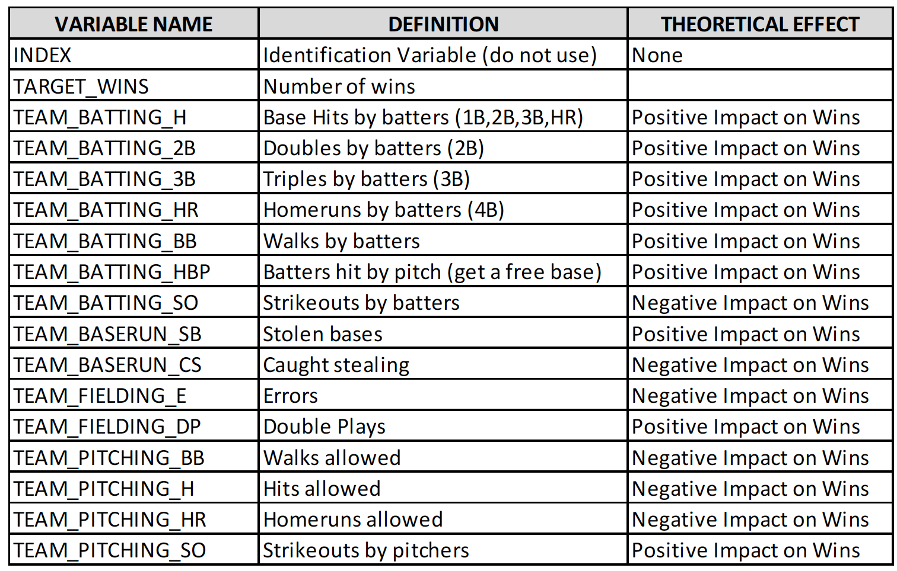

## Group 2 members: Alice Friedman, Diego Correa, Jagdish Chhabria, Orli Khaimova, Richard Zheng, Stephen Haslett.

```{r setup }
# Disable scientific numbers for readability purposes.
options(scipen = 999)
```

## Introduction to Assignment Objective

In this assignment, we analyze and model a baseball dataset containing multi-year game statistics for different teams. The objective is to build a multiple linear regression model on the training data to predict the number of wins for the team. We can only use the variables given to us (or variables that we derive from the variables provided).

### Data

There are 2 datasets provided - The Moneyball training dataset contains 17 columns and 2276 rows. Each record in the Money Ball training dataset represents a professional baseball team from the years 1871 to 2006 inclusive. Each record has the performance of the team for the given year, with all of the statistics adjusted to match the performance of a 162 game season. For this assignment, the target variable in the dataset is TARGET_WINS.

Below is a short description of the variables of interest in the data set:



## Purpose of Analysis

The purpose of the analysis is to find which of the predictors have significant ability to explain the variation in the response variable (number of wins by a team), and to make a prediction for all the records provided in the test data set.

## Method
The method used is a multiple linear regression model on the training data to predict the number of wins for the team.

## Setup

This analysis requires installation of the following packages: 

### Load required libraries

```{r echo=FALSE message=FALSE}

library(MASS)
library(tidyverse)
library(dplyr)
library(reshape2)
library(kableExtra)
library(corrplot)
library(ggplot2)
library(Hmisc)
library(PerformanceAnalytics)
library(GGally)
library(ggpubr)
library(car)

```


### Load training data

```{r load_training_data, message=FALSE}
# Load in the training data.

url = "https://raw.githubusercontent.com/Jagdish16/CUNY_DATA_621/main/project_1/moneyball-training-data.csv"
mb_training<-read.csv(url)

# Remove the INDEX variable as it is of no value in the data evaluation.
mb_training<-subset(mb_training,select=-c(INDEX))

```

### Rename Columns

Rename the columns to be more intuitive.

```{r renameColumns include=FALSE echo=FALSE message=FALSE}

mb_training <- mb_training %>%
  rename_with(~ gsub("TEAM_", "", .x)) %>%
  rename_with(stringr::str_to_title) %>%
  dplyr::rename(
    Wins = Target_wins,
    Hits = Batting_h,
    Doubles = Batting_2b,
    Triples = Batting_3b,
    HomeRuns = Batting_hr,
    Walks_AtBat = Batting_bb,
    StrikeOuts_AtBat = Batting_so,
    BasesStolen = Baserun_sb,
    OutStealingBases = Baserun_cs,
    Hits_Allowed = Pitching_h,
    HitByPitch_AtBat = Batting_hbp,
    Errors = Fielding_e,
    HomeRuns_Allowed = Pitching_hr,
    Walks_Allowed = Pitching_bb,
    StrikeOuts = Pitching_so,
    DoublePlays = Fielding_dp
  )
```

### Data Exploration 

The first variable in the above table (INDEX) was dropped from the dataset due to the fact that it is mearly a row identifier, and has no impact on the target variable (TARGET_WINS).

### Summary Statistics

The first step in our data exploration was to compile summary statistics to give us some insight into the data prior to preparing the data for modeling. To make the variable names more readable, we removed the "TEAM_" prefix from each variable.

```{r include=FALSE echo=FALSE message=FALSE warning=FALSE}
# Summarize the data
summary(mb_training)

```

From the above, we see that there are 15 predictors and 1 response variable (Wins). Of the predictors, 6 have missing values.
We now plot boxplots for all the variables to get a sense of outliers.

``` {r boxplots, warning=FALSE, message=FALSE}

# Plot boxplots for all variables
long <-mb_training %>% as.data.frame() %>% melt()

long %>%
  ggplot(aes(x=value)) + geom_boxplot() + facet_wrap(~variable, scales='free')
  
```
From the box plots, we can see that quite a few predictors are very skewed in nature, such as Walks_Allowed and Hits_Allowed.

### Variable Distributions

Plot the distributions of all the variables to check the shape visually and get a high-level, intuitive sense of normality. We plot the distributions of the features below.

```{r dataDistributions, error=FALSE, warning=FALSE}

# Wins
ggplot(data = moneyball_training, aes(x = WINS))  +
  geom_histogram( color = 'black', fill =  'gray') +
  geom_vline(aes(xintercept = mean(WINS)),
             linetype = 'dashed', size = 2, color = 'blue') +
  geom_label(aes(x = 50, y = 125,
                 label = str_replace_all(toString(summary(moneyball_training['WINS'])), ',', '\n')
                 )) +
  labs(title = 'Wins Histogram Plot', y = 'Count', x = 'Wins')

#Hits
ggplot(data = moneyball_training, aes(x = B_H))  +
  geom_histogram( color = 'black', fill =  'gray') +
  geom_vline(aes(xintercept = mean(B_H)),
             linetype = 'dashed', size = 2, color = 'blue') +
  geom_label(aes(x = 1250, y = 100,
                 label = str_replace_all(toString(summary(moneyball_training['B_H'])), ',', '\n')
                 )) +
  labs(title = 'Hits Histogram Plot', y = 'Count', x = 'Base Hits')

# Singles
ggplot(data = moneyball_training, aes(x = B_1B))  +
  geom_histogram( color = 'black', fill =  'gray') +
  geom_vline(aes(xintercept = mean(B_1B)),
             linetype = 'dashed', size = 2, color = 'blue') +
  geom_label(aes(x = 1250, y = 100,
                 label = str_replace_all(toString(summary(moneyball_training['B_1B'])), ',', '\n')
                 )) +
  labs(title = 'Base Hits Histogram Plot', y = 'Count', x = 'Base Hits')


# Doubles
ggplot(data = moneyball_training, aes(x = B_2B))  +
  geom_histogram( color = 'black', fill =  'gray') +
  geom_vline(aes(xintercept = mean(B_2B)),
             linetype = 'dashed', size = 2, color = 'blue') +
  geom_label(aes(x = 160, y = 100,
                 label = str_replace_all(toString(summary(moneyball_training['B_2B'])), ',', '\n')
                 )) +
  labs(title = 'Doubles Histogram Plot', y = 'Count', x = 'Doubles')


# Triples
ggplot(data = moneyball_training, aes(x = B_3B))  +
  geom_histogram( color = 'black', fill =  'gray') +
  geom_vline(aes(xintercept = mean(B_3B)),
             linetype = 'dashed', size = 2, color = 'blue') +
  geom_label(aes(x = 75, y = 130,
                 label = str_replace_all(toString(summary(moneyball_training['B_3B'])), ',', '\n')
                 )) +
  labs(title = 'Triples Histogram Plot', y = 'Count', x = 'Triples')


# Homeruns
ggplot(data = moneyball_training, aes(x = B_HR))  +
  geom_histogram( color = 'black', fill =  'gray') +
  geom_vline(aes(xintercept = mean(B_HR)),
             linetype = 'dashed', size = 2, color = 'blue') +
  geom_label(aes(x = 25, y = 90,
                 label = str_replace_all(toString(summary(moneyball_training['B_HR'])), ',', '\n')
                 )) +
  labs(title = 'Homeruns Histogram Plot', y = 'Count', x = 'Homeruns')


# Walks
ggplot(data = moneyball_training, aes(x = B_BB))  +
  geom_histogram( color = 'black', fill =  'gray') +
  geom_vline(aes(xintercept = mean(B_BB)),
             linetype = 'dashed', size = 2, color = 'blue') +
  geom_label(aes(x = 380, y = 100,
                 label = str_replace_all(toString(summary(moneyball_training['B_BB'])), ',', '\n')
                 )) +
  labs(title = 'Walks Histogram Plot', y = 'Count', x = 'Walks')


# Strike Out by Batters
ggplot(data = moneyball_training, aes(x = B_SO))  +
  geom_histogram( color = 'black', fill =  'gray') +
  geom_vline(aes(xintercept = mean(B_SO)),
             linetype = 'dashed', size = 2, color = 'blue') +
  geom_label(aes(x = 380, y = 100,
                 label = str_replace_all(toString(summary(moneyball_training['B_SO'])), ',', '\n')
                 )) +
  labs(title = 'Strike Out by Batters Histogram Plot', y = 'Count', x = 'Strike Out by Batters')


# Stolen Bases
ggplot(data = moneyball_training, aes(x = BR_SB))  +
  geom_histogram( color = 'black', fill =  'gray') +
  geom_vline(aes(xintercept = mean(BR_SB)),
             linetype = 'dashed', size = 2, color = 'blue') +
  geom_label(aes(x = 200, y = 100,
                 label = str_replace_all(toString(summary(moneyball_training['BR_SB'])), ',', '\n')
                 )) +
  labs(title = 'Stolen Bases Histogram Plot', y = 'Count', x = 'Stolen Bases')


# Hits Allowed
ggplot(data = moneyball_training, aes(x = P_H))  +
  geom_histogram( color = 'black', fill =  'gray') +
  geom_vline(aes(xintercept = mean(P_H)),
             linetype = 'dashed', size = 2, color = 'blue') +
  geom_label(aes(x = 1250, y = 100,
                 label = str_replace_all(toString(summary(moneyball_training['P_H'])), ',', '\n')
                 )) +
  labs(title = 'Hits Allowed Histogram Plot', y = 'Count', x = 'Hits Allowed')


# Homeruns Allowed
ggplot(data = moneyball_training, aes(x = P_HR))  +
  geom_histogram( color = 'black', fill =  'gray') +
  geom_vline(aes(xintercept = mean(P_HR)),
             linetype = 'dashed', size = 2, color = 'blue') +
  geom_label(aes(x = 30, y = 90,
                 label = str_replace_all(toString(summary(moneyball_training['P_HR'])), ',', '\n')
                 )) +
  labs(title = 'Homeruns Allowed Histogram Plot', y = 'Count', x = 'Homeruns Allowed')


# Walks Allowed
ggplot(data = moneyball_training, aes(x = P_BB))  +
  geom_histogram( color = 'black', fill =  'gray') +
  geom_vline(aes(xintercept = mean(P_BB)),
             linetype = 'dashed', size = 2, color = 'blue') +
  geom_label(aes(x = 375, y = 100,
                 label = str_replace_all(toString(summary(moneyball_training['P_BB'])), ',', '\n')
                 )) +
  labs(title = 'Walks Allowed Histogram Plot', y = 'Count', x = 'Walks Allowed')


# Strikeouts by Pitchers
ggplot(data = moneyball_training, aes(x = P_SO))  +
  geom_histogram( color = 'black', fill =  'gray') +
  geom_vline(aes(xintercept = mean(P_SO)),
             linetype = 'dashed', size = 2, color = 'blue') +
  geom_label(aes(x = 425, y = 100,
                 label = str_replace_all(toString(summary(moneyball_training['P_SO'])), ',', '\n')
                 )) +
  labs(title = 'Strikeouts by Pitchers Histogram Plot', y = 'Count', x = 'Strikeouts by Pitchers')


# Errors
ggplot(data = moneyball_training, aes(x = F_E))  +
  geom_histogram( color = 'black', fill =  'gray') +
  geom_vline(aes(xintercept = mean(F_E)),
             linetype = 'dashed', size = 2, color = 'blue') +
  geom_label(aes(x = 225, y = 100,
                 label = str_replace_all(toString(summary(moneyball_training['F_E'])), ',', '\n')
                 )) +
  labs(title = 'Errors Histogram Plot', y = 'Count', x = 'Errors')

# Double Plays
ggplot(data = moneyball_training, aes(x = F_DP))  +
  geom_histogram( color = 'black', fill =  'gray') +
  geom_vline(aes(xintercept = mean(F_DP)),
             linetype = 'dashed', size = 2, color = 'blue') +
  geom_label(aes(x = 110, y = 100,
                 label = str_replace_all(toString(summary(moneyball_training['F_DP'])), ',', '\n')
                 )) +
  labs(title = 'Double Plays Histogram Plot', y = 'Count', x = 'Double Plays')

```

The histograms provide additional confirmation that some of the variables are quite skewed. For example: Errors, Triples and Walks_AtBat. There are other variables with what look like bi-modal type of distributions. For example: StrikeOuts_AtBat.
There are a couple of variables that look closer to the normal distribution. For example - the response variable Wins.


### Data Preparation 
### Missing Data - Handling NA values

We now dig deeper into the extent of missing data for the predictors.

```{r missingDataPercentages, echo=FALSE}

# Create a table of variables sorted by percentage of missing data. 
missing_data <- colSums(mb_training %>% sapply(is.na))
percentage_missing <- round(missing_data / nrow(mb_training_data) * 100, 2)
missing_values_table <- sort(percentage_missing, decreasing = TRUE)

missing_values_table %>%
  kable(caption = 'Breakdown of Variables by Percentage of Missing Data') %>%
  kable_styling()
```


91.61% percent of the rows are missing from the HitByPitch_AtBat variable, so we will remove this variable from the dataset completely. The percentage of missing data for the remaining variables with missing data is much less, and so excluding them from the final model could skew the results. Therefore, rather than dropping the variables completely, we will impute the missing values with the median value of the variable column in question.


```{r missingDataManipulation, echo=FALSE}
# Drop the HitByPitch_AtBat variable from the dataset
mb_training <- mb_training %>% dplyr::select(-HitByPitch_AtBat)
```


We now need to deal with 2 more data issues:
1) significant outliers
2) missing values

We could possibly drop rows with either of the 2 issues mentioned above, but then we may end up losing a fair amount of data. So we decide to remove the outliers for some of the more extreme cases, and then from the updated dataset, we impute the missing values with the median of the respective predictor variable.

The following columns look like they have significant outliers:
- Walks_Allowed
- BasesStolen
- StrikeOuts
- Hits_Allowed
- Errors
- Triples

### Handling extreme values

```{r include=FALSE echo=FALSE message=FALSE warning=FALSE}
# Remove outlier rows for 6 predictor variables

mb_training_updated<-mb_training

#Remove outliers - Method 2
for (n in c("Walks_Allowed","BasesStolen","StrikeOuts","Hits_Allowed","Errors","Triples")) {
  Q<-quantile(mb_training[,n],probs=c(.25,.75),na.rm=TRUE)
  iqr<-IQR(mb_training[,n],na.rm=TRUE)
  up<-Q[2]+1.5*iqr # Upper Range  
  low<-Q[1]-1.5*iqr # Lower Range
  mb_training_updated<-subset(mb_training_updated,mb_training_updated[,n]>(Q[1]-1.5*iqr)&mb_training_updated[,n]<(Q[2]+1.5*iqr))
}

```


```{r include=FALSE echo=FALSE message=FALSE warning=FALSE}
# Check the summary for the updated dataframe
summary(mb_training_updated)

```

```{r include=FALSE echo=FALSE message=FALSE warning=FALSE}
# Impute missing values with the median value for each remaining column

mb_training_updated<-data.frame(sapply(mb_training_updated,function(x) ifelse(is.na(x),median(x,na.rm = TRUE),x)))

```


```{r include=FALSE echo=FALSE message=FALSE warning=FALSE}
# Check the summary for the updated dataframe
summary(mb_training_updated)

```

### Correlation between predictors and between predictors and response variable
We now check which of the predictors are more correlated with the response variable as a mechanism to select which variables to include in the linear regression model. We also check the correlation between the predictors, since we'd like to avoid multi-collinearity.

```{r correlationTable}
# Perform a correlation analysis on the data. In this analysis, we are only interested in the
# correlation of the predicter variables and the "TARGET_WINS" variable.
correlation_table <- cor(mb_training_updated, method = 'pearson', use = 'complete.obs')[,1]

# Remove the TARGET_WINS variable from the correlation table as it is redundant 
# within the context of of our correlation analysis.
correlation_table <- correlation_table[-c(1)]

correlation_table %>%
  kable(caption = 'Correlation of Variables to Wins') %>% kable_styling()
```


```{r}
# Calculate correlation between variables
mb_training_updated_corr_matrix<-mb_training_updated%>%cor()%>%round(2)%>%as.matrix()
mb_training_updated_corr_matrix%>%kable()%>%kable_styling()

```


```{r include=FALSE echo=FALSE message=FALSE warning=FALSE}
# flattenCorrMatrix
# cormat : matrix of the correlation coefficients
# pmat : matrix of the correlation p-values
flattenCorrMatrix <- function(cormat, pmat) {
  ut <- upper.tri(cormat)
  data.frame(
    row = rownames(cormat)[row(cormat)[ut]],
    column = rownames(cormat)[col(cormat)[ut]],
    cor  =(cormat)[ut],
    p = pmat[ut]
    )
}
```


```{r include=FALSE echo=FALSE message=FALSE warning=FALSE}
# Another method to check correlations and their significance
corr.mat<-rcorr(as.matrix(mb_training_updated))

flattenCorrMatrix(corr.mat$r,corr.mat$P)%>%filter(row=='Wins')%>%arrange(-abs(cor))

```

Based on the p-values, we could exclude the following variables from the regression model: StrikeOuts_AtBat, DoublePlays and  OutStealingBases

### Check for normality of predictors

```{r include=FALSE echo=FALSE message=FALSE warning=FALSE}
# Run the Shapiro wilkes test for normality
do.call(rbind, lapply(mb_training_updated,function(x) shapiro.test(x)[c("statistic", "p.value")]))

```

From the above, it looks like most of the predictors are close to normality.


#### Model 1

Model 1 includes the remaining variables in the dataset except for the one dropped earlier due to lots of missing values.

```{r ModelOne}
model_one <- lm(Wins~Hits+Doubles+Triples+HomeRuns+Walks_AtBat+BasesStolen                                           +Hits_Allowed+HomeRuns_Allowed+Errors+ Walks_Allowed + StrikeOuts  
            +StrikeOuts_AtBat+OutStealingBases+DoublePlays, data=mb_training_updated)

```


##### Model 1 Statistics

**Model 1 Summary Stats**

```{r modelOneSummaryStats, error=FALSE, warning=FALSE, echo=FALSE, message=FALSE}
summary(model_one)
```
We see that the adjusted R-squared for this model is 0.40 i.e. these predictors explain about 40% of the variability in the response variable.


**Model 1 R Squared**
```{r modelOneRSquared, error=FALSE, warning=FALSE, echo=FALSE, message=FALSE}
summary(model_one)$r.squared
```
**Model 1 Confidence Intervals**

We calculate the 95% confidence intervals for each of the co-efficients and the intercept for this model.

```{r modelOneConfidenceIntervals, error=FALSE, warning=FALSE, echo=FALSE, message=FALSE}
confint(model_one)
```

##### Model 1 Plots

We plot the residuals versus the fitted values - it shows that the residuals are scattered fairly evenly and there doesn't seem to be a trend. The distribution of the residuals does not seem very skewed. The same can be seen through the qq-plot as well.


```{r modelOnePlots, error=FALSE, warning=FALSE, echo=FALSE, message=FALSE}
ggplot(data = model_one, aes(x = .fitted, y = .resid)) +
  geom_point() + geom_hline(yintercept = 0, linetype = "dashed") +
  geom_smooth(se = FALSE) + xlab("Fitted values") + ylab("Residuals")

#qqnorm(resid(model_one), main = "Normal Q-Q Plot", col = "darkgrey")
#qqline(resid(model_one), col = "dodgerblue", lwd = 2)

ggplot(data = model_one, aes(x = .resid)) + geom_histogram() + xlab("Residuals")

ggplot(data = model_one) + stat_qq(aes(sample = .stdresid)) + geom_abline()

```

#### Model 2

Model 2 uses stepwise regression on the variables in Model 1 to create the best performing model.

```{r ModelTwo}
model_two <- stepAIC(model_one, direction = 'both', trace = FALSE)
```


**Model 2 Summary Stats**

```{r modelTwoSummaryStats, error=FALSE, warning=FALSE, echo=FALSE, message=FALSE}
summary(model_two)
```
However we see minimal impact to the R-squared value, which remains around 0.40.

##### Model 2 Plots

```{r modelTwoPlots, error=FALSE, warning=FALSE, echo=FALSE, message=FALSE}

ggplot(data = model_two, aes(x = .fitted, y = .resid)) +
  geom_point() + geom_hline(yintercept = 0, linetype = "dashed") +
  geom_smooth(se = FALSE) + xlab("Fitted values") + ylab("Residuals")

ggplot(data = model_two, aes(x = .resid)) + geom_histogram() + xlab("Residuals")

ggplot(data = model_two) + stat_qq(aes(sample = .stdresid)) + geom_abline()

```
Wins = Target_wins,
    Hits = Batting_h,
    Doubles = Batting_2b,
    Triples = Batting_3b,
    HomeRuns = Batting_hr,
    Walks_AtBat = Batting_bb,
    StrikeOuts_AtBat = Batting_so,
    BasesStolen = Baserun_sb,
    OutStealingBases = Baserun_cs,
    Hits_Allowed = Pitching_h,
    HitByPitch_AtBat = Batting_hbp,
    Errors = Fielding_e,
    HomeRuns_Allowed = Pitching_hr,
    Walks_Allowed = Pitching_bb,
    StrikeOuts = Pitching_so,
    DoublePlays = Fielding_dp

##### Model 3

For Model 3, we create a new dataframe and derive some new variables by transforming existing predictors to include in this dataframe:
- Singles is derived as the difference between all Hits and Doubles, Triples and Home Runs
- Homeruns difference is the difference between home runs scored and allowed. 

We also include certain variables derived on the fly in the model - for example: the ratio between Home runs allowed and scores, the product of home runs allowed and scored, the reciprocal of Double plays and the cube of the stolen basis variable.


```{r include=FALSE echo=FALSE message=FALSE warning=FALSE}
# Derive 2 new variables for Singles and Home run difference.

mb_training_new<-mb_training_updated%>%mutate(Singles=Hits-Doubles-Triples-HomeRuns)

mb_training_new<-mb_training_new%>%mutate(Homeruns_diff=HomeRuns_Allowed-HomeRuns)
```


```{r modelThree, error=FALSE, warning=FALSE, echo=FALSE, message=FALSE}

model_three <- lm(Wins~Hits+Doubles+Triples+Walks_AtBat+BasesStolen                                                    +Hits_Allowed+Errors+ Walks_Allowed + StrikeOuts  
                +Singles+Homeruns_diff +StrikeOuts_AtBat
                +I(HomeRuns_Allowed/HomeRuns) + I(HomeRuns_Allowed*HomeRuns) 
                +I(1/DoublePlays)+ I(OutStealingBases^3), data=mb_training_new)

```


**Model 3 Summary Stats**

```{r modelThreeSummaryStats, error=FALSE, warning=FALSE, echo=FALSE, message=FALSE}
summary(model_three)
```

We don't see much change to the R-squared value.

**Model 3 R-Squared**
```{r modelThreeRSquared, error=FALSE, warning=FALSE, echo=FALSE, message=FALSE}
summary(model_three)$r.squared
```

**Model 3 Confidence Intervals**

```{r modelThreeConfidenceIntervals, error=FALSE, warning=FALSE, echo=FALSE, message=FALSE}
confint(model_three)
```

##### Model 3 Plots

```{r modelThreePlots, error=FALSE, warning=FALSE, echo=FALSE, message=FALSE}

ggplot(data = model_three, aes(x = .fitted, y = .resid)) +
  geom_point() + geom_hline(yintercept = 0, linetype = "dashed") +
  geom_smooth(se = FALSE) + xlab("Fitted values") + ylab("Residuals")

ggplot(data = model_three, aes(x = .resid)) + geom_histogram() + xlab("Residuals")

ggplot(data = model_three) + stat_qq(aes(sample = .stdresid)) + geom_abline()

```
There is not much change in the scatter plot of the residuals with the fitted values, and the distribution of errors does not seem to have changed much.

#### Model 4 - Box Cox transformation

For our final model (Model 4), we do a Box Cox transformation on the response variable from Model 1 to see if it provides a better-fitting model. We plot the lambda and based on the plot, a lambda value of around 1.35 seems like the best value.

```{r modelFour}
#Box Cox method

MASS::boxcox(model_one, lambda = seq(0.75, 1.6, by = 0.05), plotit = TRUE)

```


```{r  modelFour}
# Fit a model using a lambda value of 1.35 for the response variable

model_cox = lm((((Wins ^ 1.35) - 1)/ 1.35) ~ Hits + Doubles + Triples + HomeRuns + Walks_AtBat + 
    BasesStolen + Hits_Allowed + HomeRuns_Allowed + Errors + 
    Walks_Allowed + StrikeOuts + StrikeOuts_AtBat + OutStealingBases + 
    DoublePlays, data = mb_training_updated)

```

##### Model 4 Statistics

**Model 4 Summary Stats**

```{r modelCoxSummaryStats, error=FALSE, warning=FALSE, echo=FALSE, message=FALSE}
summary(model_cox)
```


**Model 4 R Squared**
```{r modelFourRSquared, error=FALSE, warning=FALSE, echo=FALSE, message=FALSE}
summary(model_cox)$r.squared
```

We don't see much impact on R-squared, possibly because the response variable was close to normal to begin with.

**Model 4 Confidence Intervals**

We calculate the 95% confidence intervals for each of the co-efficients and the intercept for this model.

```{r modelFourConfidenceIntervals, error=FALSE, warning=FALSE, echo=FALSE, message=FALSE}
confint(model_cox)
```

##### Model 4 Plots

We plot the residuals versus the fitted values - it shows that the residuals are scattered fairly evenly and there doesn't seem to be a trend. The distribution of the residuals does not seem very skewed. The same can be seen through the qq-plot as well.


```{r modelFourPlots, error=FALSE, warning=FALSE, echo=FALSE, message=FALSE}
ggplot(data = model_cox, aes(x = .fitted, y = .resid)) +
  geom_point() + geom_hline(yintercept = 0, linetype = "dashed") +
  geom_smooth(se = FALSE) + xlab("Fitted values") + ylab("Residuals")

ggplot(data = model_cox, aes(x = .resid)) + geom_histogram() + xlab("Residuals")

ggplot(data = model_cox) + stat_qq(aes(sample = .stdresid)) + geom_abline()

```
The residuals for this model behave similarly to the residuals from the previous model.


## Model Selection
We decide to use model one for making predictions for the test dataset, since the other models do not provide a sgnificant improvement over it.


#### Predicting the response variable for the test dataset

We now predict the number of wins for the test data using model one.

```{r load_test_data, message=FALSE}

# Load in the test data.}
url2 <- 'https://raw.githubusercontent.com/Jagdish16/CUNY_DATA_621/main/project_1/moneyball-evaluation-data.csv'

mb_test <- read.csv(url2)

# Remove the INDEX variable as it is of no value in the data evaluation.
mb_test<-subset(mb_test,select=-c(INDEX))

```


```{r message=FALSE}
# Summarize the test data
summary(mb_test)
```
### Rename Columns

We now rename the columns for this test dataset to be more intuitive.

```{r renameColumns}

mb_test <- mb_test %>%
  rename_with(~ gsub("TEAM_", "", .x)) %>%
  rename_with(stringr::str_to_title) %>%
  dplyr::rename(
    Hits = Batting_h,
    Doubles = Batting_2b,
    Triples = Batting_3b,
    HomeRuns = Batting_hr,
    Walks_AtBat = Batting_bb,
    StrikeOuts_AtBat = Batting_so,
    BasesStolen = Baserun_sb,
    OutStealingBases = Baserun_cs,
    Hits_Allowed = Pitching_h,
    HitByPitch_AtBat = Batting_hbp,
    Errors = Fielding_e,
    HomeRuns_Allowed = Pitching_hr,
    Walks_Allowed = Pitching_bb,
    StrikeOuts = Pitching_so,
    DoublePlays = Fielding_dp
  )
```

We impute the missing values with the median

```{r include=FALSE echo=FALSE message=FALSE warning=FALSE}
# Impute missing values with the median value for each column

mb_test_updated<-data.frame(sapply(mb_test,function(x) ifelse(is.na(x),median(x,na.rm = TRUE),x)))

```


We now check the summary to see if the missing values have been filled.

```{r summary}
# Summarize the test data
summary(mb_test_updated)
```


```{r include=FALSE echo=FALSE message=FALSE warning=FALSE}

# Predicting Wins in the test data and looking at the distribution 
mb_test_updated$predicted_wins <- predict(model_one, type = 'response', newdata = mb_test_updated)

ggplot(data = mb_test_updated, aes(x = predicted_wins))  +
  geom_histogram( color = 'black', fill =  'gray') +
  geom_vline(aes(xintercept = mean(predicted_wins)), linetype = 'dashed', size = 2, color = 'blue') +
  geom_label(aes(x = 500, y = 150,label= str_replace_all(toString(summary(mb_test_updated['predicted_wins'])),',','\n'))) +
  labs(title = 'Wins Prediction Histogram Plot', y = 'Count', x = 'Wins Prediction')

```
We create a table for the predicted wins.

```{r include=FALSE echo=FALSE message=FALSE warning=FALSE}
# creating a table of prediction and confidence intervals
test_data <- predict(model_one, newdata = mb_test_updated, interval = 'prediction')
summary(test_data)
```


## Conclusion

We conclude that model one which includes a majority of the predictors except one provides the best overall fit. While we did try additional models based on transformed variables, they did not provide a significant improvement, so we decided to go with model one. This model does not seem to violate the assumptions of linear regression.


## References

Sellmair, Reinhard. "How to handle correlated Features?" June 25, 2018. https://www.kaggle.com/reisel/how-to-handle-correlated-features

Xie, Yihui, J. J. Allaire, and Garrett Grolemund, *R Markdown: The Definitive Guide*, CRC PressDecember 14, 2020 https://bookdown.org/yihui/rmarkdown/r-code.html. 

https://rstatisticsblog.com/data-science-in-action/data-preprocessing/six-amazing-function-to-create-train-test-split-in-r/


